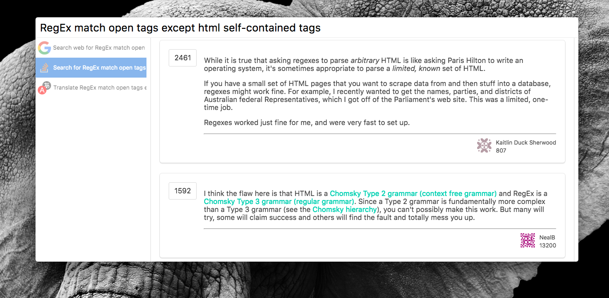

# Cerebro Stackoverflow

> Cerebro plugin to find answers to questions on stack overflow

## Usage
In Cerebro, type a search query. The first few questions will show in the detail pane. Clicking on any of them will show the question body and any of the answers it has.

## Features
* Search for questions on stack overflow with google or with the stack exchange search api.
* Show preview with more details: poster, body, answers.

### Common Issues
Google and Stackoverflow implement some form of rate limiting, so constant searches over a short period of time will eventually lead to errors.

### Todo
- [x] Add loading indicator.
- [x] Indicate selected answer.
- [x] Show the user that posted each answer.
- [x] Make a proper usage gif or screenshot.

## Related
* [how2](https://github.com/santinic/how2) - inspired the idea for this plugin
* [Cerebro](http://github.com/KELiON/cerebro) – main repo for Cerebro app
* [cerebro plugin boilerplate](https://github.com/KELiON/cerebro-plugin) – boilerplate used to create this plugin

## License

MIT © Ezinwa Okpoechi
